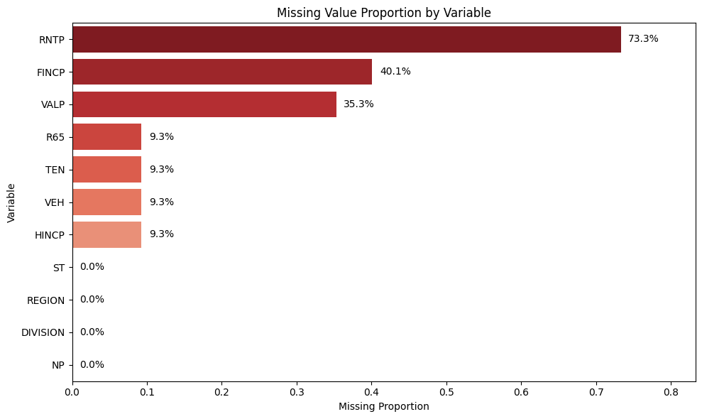
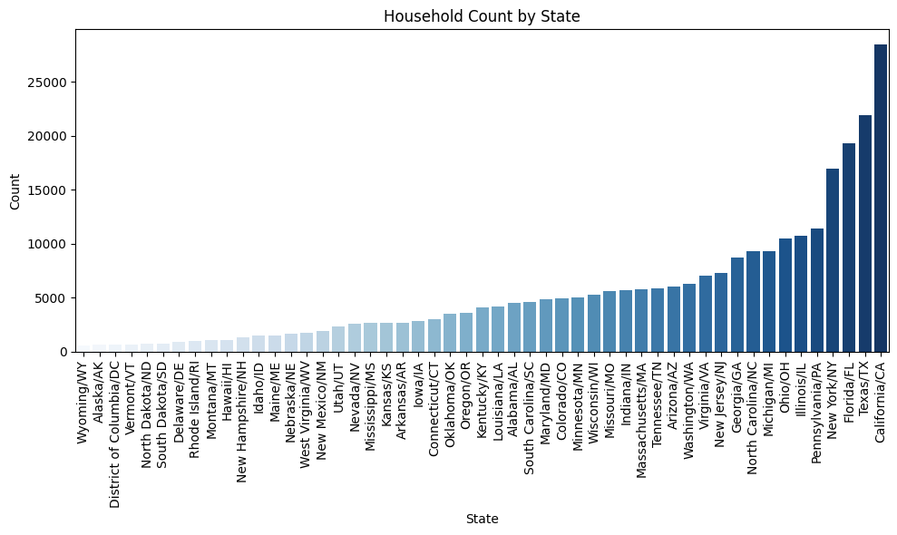

# ACS Housing and Income Analysis

This project analyzes household-level demographic, housing, property value, income, and rent patterns using American Community Survey data.


## Project Overview

The analysis explores regional household characteristics, compares household income between Michigan and Ohio, and uses simulation to study the sampling distribution of monthly rent estimates.


## Sample Visualization




## Main Features

- Exploratory analysis of ACS household variables
- Property value distribution analysis
- Regional household distribution by Census division
- Monthly rent simulation with different sample sizes
- Visualization of sampling distributions


## Project Structure
```text
acs-housing-income-analysis/
├──.github/workflows
├── data/
│   ├── pums_short.csv.gz
│   └── PUMS_Data_Dictionary_2018.pdf
├── notebooks/
│   └── eda.ipynb
├── src/
│   └── eda.py
├── figures/
│   ├── 01_missing_value_proportion.png
│   ├── 02_st_counts.png
│   ├── 03_ordered_st_counts.png
│   ├── 04_rntp_distr_box.png
│   ├── 05_rntp_distr_hist.png
│   ├── 06_mcs_rntp.png
│   ├── 07_rntp_div.png
│   ├── 08_hincp_box.png
│   ├── 09_hincp_hist.png
│   ├── 10_adj_hincp_box.png
│   └── 11_adj_hincp_hist.png
├── README.md
└── requirements.txt
```

## Tools Used

- Python
- pandas
- numpy
- seaborn
- matplotlib
